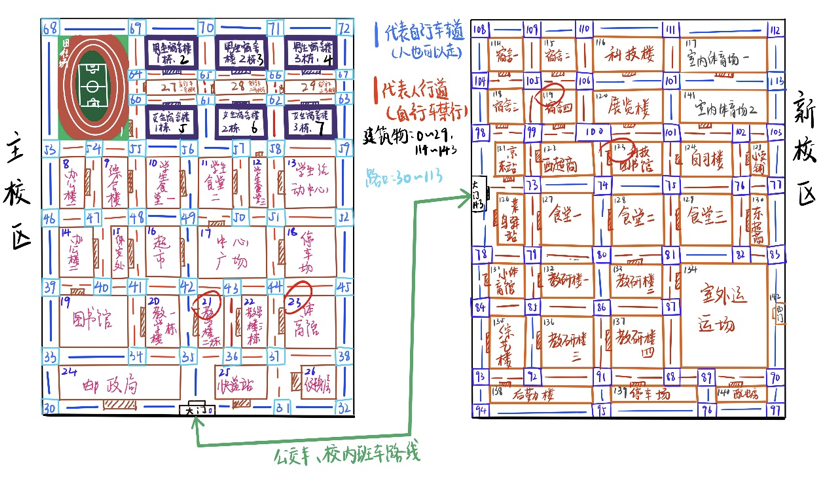
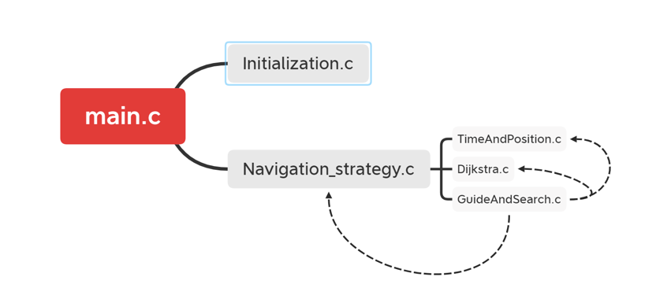

# 校园导览系统

## 一、任务描述

设计一个导航系统，能够根据同学提出的导航要求来设计合理的导航路线及查询当前时刻同学所处的地点和周围一定范围内的教学楼、宿舍楼、餐饮、后勤服务、操场等信息以及这些地点到同学所处位置的距离。

 

## 二、功能需求及程序设计分析

1. **建立校园内部的道路图**：根据编写的道路图的文档将道路图存在带权有向图中，图以邻接矩阵的方式存储，同时建立存储建筑物信息的结构体数组，然后按照要求对每个校区都建立一个道路图

2. **导航起点和终点**：导航的起点和终点分为逻辑位置和物理位置，物理位置即实际位置，逻辑位置为某学生的课程所对应的上课地点，每一个逻辑位置对应一个或多个物理位置。可将物理位置存储于建筑信息的结构体数组中，逻辑位置存储于另一个存储逻辑位置信息的结构体数组中。该结构体包含逻辑位置的名字和对应物理位置的信息，在用户输入起始/目的时可以以逻辑-物理位置对照表输入地点。

3. **校区间的导航**：不同校区间的导航需要包含两校区间的通行，默认有校车和公交车两种方式。

4. **导航策略**：导航策略共四种，前三种为最短距离、最短时间、途径某些点的最短距离，这三种都默认为校园内步行，第四种为可选择交通工具的最短时间，即可选择自行车时的最短时间，实际上一、三两种策略为最短距离，二、四两种为最短时间。本程序计划以Dijkstra算法为基础的算法解决此问题，在实际计算路径时，会将拥挤度/速度代偿入实际距离中，进而得出最优路径算法。

5. **模拟导航和日志文件建立：**需要模拟导航的进程，即按照一定速度来模拟同学的行进过程，每隔5秒导航模拟时间向前推进1分钟。程序运行过程中会将学生进入导航的时间、实际所查询的路线、以及学生位置状态的变化写入日志文件中。

6. **查询自己位置和周围一定范围内信息**：用户可以实时查询自己所处的位置，能够查询周围的教学楼、学生宿舍和其他服务设施；系统需要给出一定范围内的教学楼（范围多大自拟）、学生宿舍和其他服务设施，并标出到这些目标的距离最短路线的距离；如果用户选定某一个目标可以给出距离最短路线。在存储建筑信息时需要将教学楼、学生宿舍等服务设施设置标签，用户在查询能获取其身边的服务设施、和其与这些服务设施的最短距离。

7. **程序基于PC机开发**。

8. **可更改目标：**某同学在行走途中可更改目标和导航策略，系统按照当前位置做相应的操作。在实际导航过程中程序可随时暂停（检测键盘输入任意字符后暂停，以新设立的线程检测输入）。本程序实现了在导航暂停后有4种操作可供用户选择：获取用户当前位置，更改导航目标或导航策略，查询周围服务设施及最短距离，保存当前位置信息退出导航系统，在下次进入导航时可以以上次的位置作为起始点。


 

## 三、总体方案设计说明（任务实现方法）

1. **地图设计：**以一个邻接矩阵存储所有点（建筑物和路口）以及所有边（有向边，即每条边理论上会存储两次）。校区分为主校区和新校区，每个校区均有30个建筑物，校区1有101条边，校区2有98条边，在两校区的大门间建立了1条边，总共200条边。



2. **算法思路**：**当程序获取到用户输入的起点与终点后，利用变式Dijkstra算法计算用户选择策略下的最优路径，最终将路线模拟时间输出。在模拟时间输出时，除了上文所述的“检测键盘输入暂停”的功能外，会调用sleep函数，以实现现实**5s-模拟1min**的时间推进；**为了节约程序运行时间，在等待公交车/校内班车时默认跳过现实时间推进，系统模拟时间会正常推进。人的速度为100m/min（模拟时间），自行车的速度为200m/min。校车的班次设计为：整点时可乘坐，耗时40分钟；公交车每隔15分钟会有一趟，耗时1小时。校车和班车都从8：00开始可乘坐。


## **四、**  模块划分与设计说明

**“HeadFile.h”**：头文件，定义了全局常量、结构体以及功能函数；

**1)**  **定义了以下全局常量：**

```c
#define VERTEX_NUM 144//新增了新校区的顶点数
#define BUILDING_NUM 30
#define BUILDING_NUM1 114
#define EDGE_NUM 200//新增了新校区的边数
#define DISTANCE_MIN 0
#define TIME_MIN 1
#define PASS_THROUGH 2
#define BICYCLE 3
#define TIME_MAX 32
#define FILE_BUFFER_LENGTH 30000
```

**2）定义了以下结构体：**

```C
typedef struct {
	int length, crowding_degree;//长度，拥挤度
	int vertex_head;//入点
	int vertex_last;//出点
	int bicycleAllow;//是否允许自行车通过
	char direction[3];//方向
}Edge, * EdgePtr;//边
typedef struct {
	int flag;//0代表路口，1代表教学楼，宿舍楼和服务设施，2代表办公楼等其他建筑
	int num;//序号
	char name[20];//建筑的名字，路口没有
}Vertex;//点，包括建筑、路口和学校大门
typedef struct {
	int vtx1;
	int vtx2;
	char direToVtx1[3];//朝vtx1的方向
	char direToVtx2[3];//朝vtx2的方向
	int distToVtx1;//朝vtx1的距离
	int distToVtx2;//朝vtx2的距离
}Position;//用户当前的位置
typedef struct {
	Vertex v[VERTEX_NUM];
	EdgePtr e[EDGE_NUM][EDGE_NUM];
}Graph;//

typedef struct threadArgument {
	int ID_thread;
	int Address_thread;
}th;
typedef struct {
	unsigned long year;
	unsigned long month;
	unsigned long day;
	unsigned long hour;
	unsigned long min;
}virtualTime;
typedef struct {
	char name[40];//逻辑地址名 
	int num;//逻辑地址序号 
	char location[30];//对应物理位置 
	int location_num;//对于物理位置建筑编号 
}Logic;
```

**3）定义了以下功能函数**

```C
void beginGuideSystem(Graph*, Position, int);//开始导航
void graph_creat(Graph*); //将地图存入graphPtr指向的Graph类型结构体中
void Logical_creat(Logic*);//创建逻辑-物理位置对照表并输出
void ShortestPathNgt(Graph*, Position, int, int);//最短路径策略
void ShortestTimeNgt(Graph*, Position, int);//最短时间策略
void ShortestPathNgt_passBy(Graph*, Position, int);//途径最短路径策略
void ShortestTimeNgt_Bike(Graph*, Position, int);//自行车最短时间策略
int* Dijkstra(Graph*, int, int, int);//Dijkstra算法
int CalculatePathLength(Graph*, int*, int, int, int);//计算路径的长度
void GuideWay_InOrder(Graph*, int[], Position, int, int, int);//导航时序输出
void GuideWay(Graph*, int[], Position, int, int,int);//导航一次性输出路线
void GuideWay_bicycle(Graph*, int[], Position, int, int);//导航输出（自行车）
void SearchAround(Graph*, Position);//查询周围服务设施信息
void Position_toString(Graph*, Position);//输出位置信息
void Position_Changing(Graph*, Position*, int, int, int);//位置状态的改变
void Time_Refreshing(virtualTime*, unsigned long, int);//时间刷新并输出
void Position_OutputToLog(Graph* , Position );//位置输出到文件
unsigned _stdcall run(void* pArguments);//线程函数
```


### 模块划分

1. **“main.c”**：初始化图、系统时间，定义全局变量，打开日志文件；

定义了以下全局变量：

```c
DWORD initTimer, startTimer, endTimer;//程序计时器变量

virtualTime curTime = { 2021,6,13,8,0 };//程序模拟的时间

FILE* logF = NULL;//日志文件输出流
```


2. **“Initialization.c”**：包含了初始化校园结构图与逻辑-物理位置对照表的功能函数；

包含功能函数：

```c
void graph_creat(Graph*); //将地图存入graphPtr指向的Graph类型结构体中

void Logical_creat(Logic*);//创建逻辑-物理位置对照表并输出
```


3. **“Navigation_Strategy.c”**：生成导航系统的主要界面，并以用户选择的导航方案开始导航；

定义了模块内全局变量：

```c
extern DWORD initTimer, endTimer;

extern virtualTime curTime;

extern FILE* logF;
```

包含功能函数：

```c
void beginGuideSystem(Graph*, Position, int);//开始导航

void ShortestPathNgt(Graph*, Position, int, int);//最短路径策略

void ShortestTimeNgt(Graph*, Position, int);//最短时间策略

void ShortestPathNgt_passBy(Graph*, Position, int);//途径最短路径策略

void ShortestTimeNgt_Bike(Graph*, Position, int);//自行车最短时间策略
```

 

4. **“Dijkstra.c”**：包含Dijkstra算法与计算由Dijkstra生成路径的长度；

包含功能函数：

```c
int* Dijkstra(Graph*, int, int, int);//Dijkstra算法

int CalculatePathLength(Graph*, int*, int, int, int);//计算路径的长度
```


5. **“TimeAndPosition.c”**：包含刷新当前时间、输出位置信息到stdout、位置状态的刷新以及输出位置信息到log文件中四个功能函数。

定义了以下模块内全局变量：

```c
extern virtualTime curTime;

extern FILE* logF;
```

包含功能函数：

```c
void Position_toString(Graph*, Position);//输出位置信息

void Position_Changing(Graph*, Position*, int, int, int);//位置状态的改变

void Time_Refreshing(virtualTime*, unsigned long, int);//时间刷新并输出

void Position_OutputToLog(Graph* , Position );//位置输出到文件
```


6. **“GuideAndSearch.c”**：包含线程函数（检测输入暂停并选择更改功能）、导航时序输出函数、输出路线至log文件功能函数（包含输出普通路线以及含骑行路线）以及搜寻周围服务设施的功能函数。

定义了以下模块内全局变量：

```c
extern DWORD initTimer, startTimer, endTimer;//程序计时器变量

HANDLE hMutex;//线程互斥变量

Graph eGraph;//图文件

Position ePos;//用户当前位置

int endFlag, whichCampus;//whichCampus代表现在用户正在哪个校区，=1为主校区，=2为新校区

extern virtualTime curTime;

extern FILE* logF;
```

包含功能函数：

```c
void GuideWay_InOrder(Graph*, int[], Position, int, int, int);//导航时序输出

void GuideWay(Graph*, int[], Position, int, int,int);//导航一次性输出路线

void GuideWay_bicycle(Graph*, int[], Position, int, int);//导航输出（自行车）

void SearchAround(Graph*, Position);//查询周围服务设施信息

unsigned _stdcall run(void* pArguments);//线程函数
```

 

### 模块间关系



## 五、数据结构

 VertexAndEdge.txt：存放所有顶点以及所有有向边

顶点：以【顶点名 flag】 格式存放，只存放建筑物的顶点，flag为1时表示该建筑物为服务设施类型，其他为2.

边：以【顶点1 顶点2 长度 拥挤度  自行车是否可通行flag 1->2的方向（东西南北）】6个参数顺序格式存放。Flag为1时该边可以通行自行车；为0则不能通行。

PositionSaved.txt: 存放退出保存的位置信息

logic.txt：存放逻辑-物理位置对照表

logfile.txt：日志文件